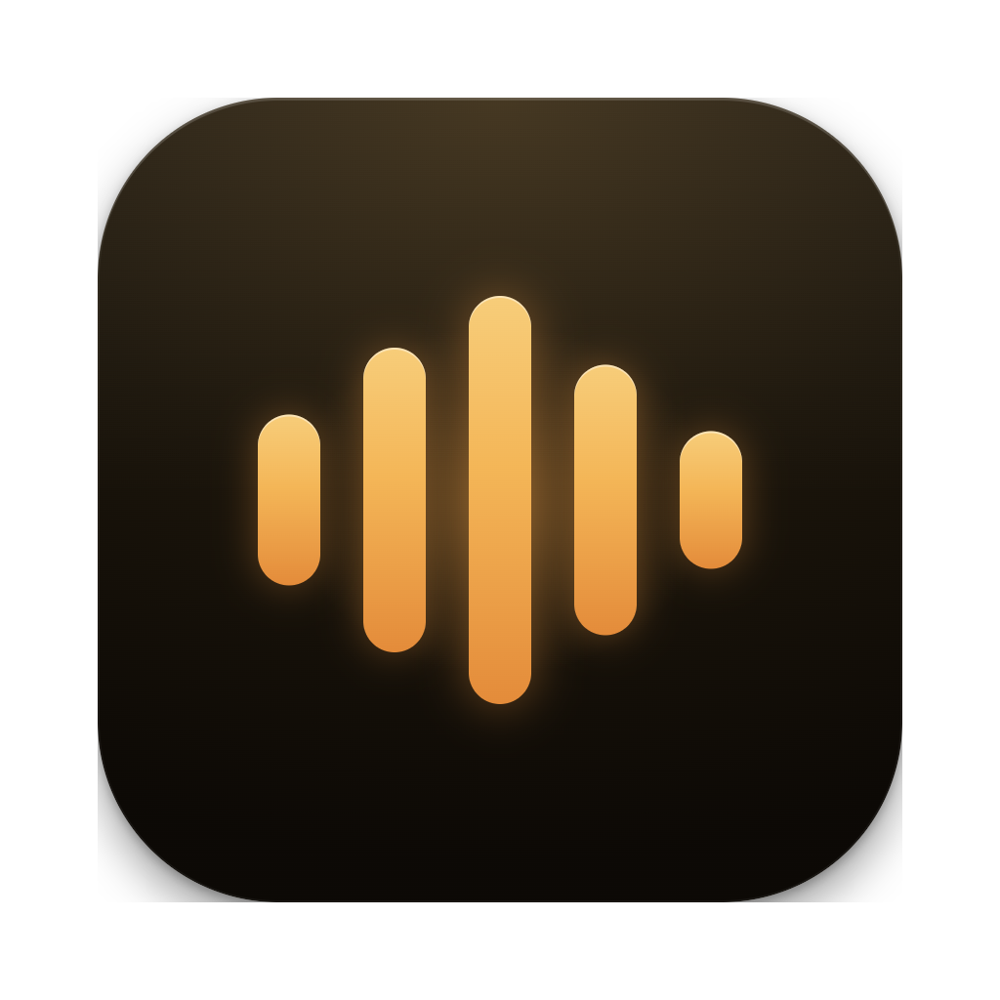

# Whisple

Local-first voice dictation for your computer.

A voice bar at the bottom of the screen. Press a shortcut, talk, and clean text lands in the app you were using — transcribed on-device, or with your own cloud key if you prefer.

[whisple.app](https://whisple.app) · [Download](https://github.com/lassejlv/whisple/releases) · [Source](https://github.com/lassejlv/whisple)

<p align="center">
  
</p>

## What it does

- **Dictate anywhere.** `Ctrl-Shift-Space` shows the bar. `Ctrl-Alt-Space` starts recording. Press the record shortcut again to finish. On macOS and Windows, Whisple types into the app you were using; on Linux the words are copied, ready to paste.
- **On-device Whisper.** Download a model once (from a 31 MB English preview to full-precision Turbo) and transcribe offline. Switch models from the bar at any time.
- **Optional cloud.** OpenAI, Groq, xAI, or Vercel AI Gateway, using a key you paste into Settings. Keys live in the system credential store, not in the repo.
- **Voice commands.** Say “Open Spotify” or “Go to github.com” and Whisple opens it.
- **Screen-aware assistant.** Start with “Hey Whisple” to ask about what you see, or have it write a reply. Uses the same cloud key, and only if you turn screen context on.
- **Clean notes.** Filler words and repeats are stripped by default so the result reads like you wrote it.

The interface is in English, Danish, German, Norwegian, Swedish, Spanish, and French. Dictation can auto-detect among twenty languages, or you can pin one and optionally translate the output.

## Download

GitHub releases include Apple silicon and Intel DMGs for macOS, and an installer (`-setup.exe`) and MSI for 64-bit Windows 10 and 11. Both platforms update themselves from new releases.

The prebuilt app has a three-day free trial, then a one-time **$19** lifetime license. Building from source is unrestricted and has no trial or license checks.

Releases are ad hoc signed and not notarized. macOS may ask you to allow the app the first time you open it. Windows builds are not code signed, so SmartScreen may warn on first launch; choose **More info › Run anyway**.

## Build from source

You need a stable Rust toolchain (`rust-toolchain.toml` pins `stable`) and [CMake](https://cmake.org), which `whisper-rs` uses to compile Whisper.

```sh
cargo run
```

That launches the unrestricted development app. There is no account and nothing to configure before onboarding.

Package a local macOS `.app` (requires `sips` and `iconutil`):

```sh
./scripts/package-macos.sh --debug   # debug bundle
./scripts/package-macos.sh           # release bundle, no licensing
./scripts/package-macos.sh --with-licensing
```

Windows and Linux can be built with `cargo run` as well. Windows has global shortcuts, the tray icon, and typing into the focused app, and `scripts/windows/package-windows.ps1` builds its installers. Linux has X11 hotkeys and autostart, without installers or auto-updates.

## Develop

```sh
cargo test --locked                      # default, license-free tests
cargo test --locked --features licensing # same checks the release workflows run
cargo fmt --check
cargo clippy --all-targets
```

Whisple is a single Rust desktop binary:

| Path | Role |
| --- | --- |
| [`src/main.rs`](src/main.rs) | GPUI app entry |
| [`src/app/`](src/app/) | State, recording, actions |
| [`src/audio/`](src/audio/) | Capture |
| [`src/transcription/`](src/transcription/) | Local Whisper, cloud STT, models, cleanup |
| [`src/assistant/`](src/assistant/) | Commands, assistant, screen context |
| [`src/ui/`](src/ui/) | Voice bar, onboarding, Settings |
| [`src/platform/`](src/platform/) | Hotkeys and OS integrations |

Contributor conventions live in [`AGENTS.md`](AGENTS.md). Release steps for macOS and Windows are in [`docs/releasing.md`](docs/releasing.md); the opt-in Polar trial is documented in [`docs/licensing.md`](docs/licensing.md).

## License

MIT. See [LICENSE](LICENSE).

Built with [GPUI](https://www.gpui.rs) and [whisper.cpp](https://github.com/ggerganov/whisper.cpp).
